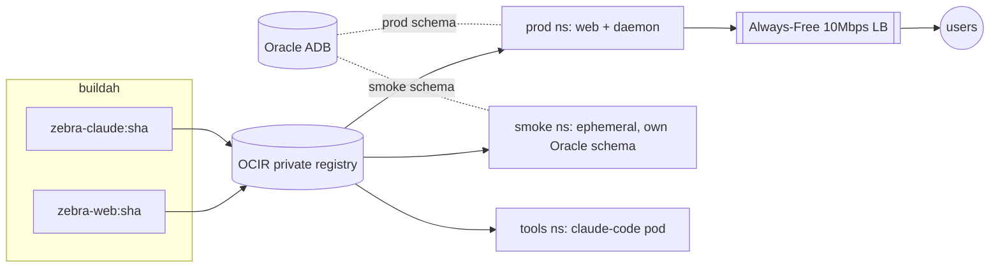

# Zebra on OKE — Infrastructure as Code

Migrates Zebra from the single Always-Free VM to **Oracle Container Engine for
Kubernetes (OKE)**, with three isolated workloads and images in **OCIR**:

| Workload | Namespace | Lifecycle | DB |
|----------|-----------|-----------|----|
| `zebra-web` + `zebra-daemon` (prod) | `prod` | always-on, fronted by the Always-Free 10 Mbps LB | Oracle **prod** schema |
| smoke instance + test run | `smoke` | **ephemeral** per CI run, then deleted | Oracle **smoke** schema |
| `claude-code` (agent + dev sandbox) | `tools` | always-on pod, repo on a PVC | — |

> **Status: scaffolding.** Nothing has been applied to any cloud account. The
> Terraform/manifests/scripts are ready to run once you complete onboarding.



## Layout
```
terraform/   OCI infra (VCN, OKE Basic, A1 node pool, OCIR, IAM)
k8s/         kustomize: base/{prod-web,prod-daemon,claude-code} + overlays/smoke
scripts/     00..50 bring-up + build/deploy/smoke; 99 cutover runbook
secrets/     *.env (git-ignored) → k8s Secrets; *.example committed
docs/        oci-onboarding.md (fresh-account guide)
Makefile     thin wrapper over scripts
```

## Quick start
1. **Onboarding** (one-time, manual): `docs/oci-onboarding.md`.
2. **Bring up infra**: `make all` (tooling → auth → infra → kubeconfig → secrets).
3. **Build + validate + deploy**:
   ```bash
   TAG=$(BUILD_CLAUDE=1 make build TAG=$(git rev-parse --short HEAD))
   make smoke  TAG=<sha>     # ephemeral, isolated; tears itself down
   make deploy TAG=<sha>     # promote the validated image to prod
   ```
4. **Migrate**: follow `scripts/99-migrate-cutover.md` (parallel week → cutover → decommission).

## Design notes
- **Build-once → smoke → promote**: the *same* `:sha` image that passes the smoke
  namespace is what `40-deploy.sh` rolls out to prod (`kustomize set image`). No rebuild.
- **Smoke isolation**: smoke runs in its own namespace against a dedicated Oracle
  schema and is deleted on exit — prod schema/budget are never touched.
- **Daemon split**: the budget daemon runs as its own `prod/zebra-daemon` Deployment
  (`manage.py run_daemon`, `Recreate` strategy) instead of the in-process
  `DaemonStarterMiddleware`, guaranteeing exactly one daemon.
- **Free-tier shape**: OKE **Basic** (free control plane), Flannel CNI, workers in a
  **public subnet + IGW** (no paid NAT), one A1 node sized 2/12 for migration → 4/24
  at cutover, single 10 Mbps LB.
- **Registry hygiene**: OCIR has no stable Terraform retention resource; prune the
  registry from the CI deploy stage (keep last N) — replaces the old host-disk cleanup.
- **CI on OKE** (later increment): GitLab Runner with the Kubernetes executor in ns
  `ci`; pipeline becomes `lint → test → e2e → build → smoke → deploy`, deploy = `kubectl set image`.

## Verify without an account
`terraform -chdir=terraform init -backend=false && terraform -chdir=terraform validate`
and `kustomize build k8s/base` both run offline (no OCI calls) to sanity-check syntax.
